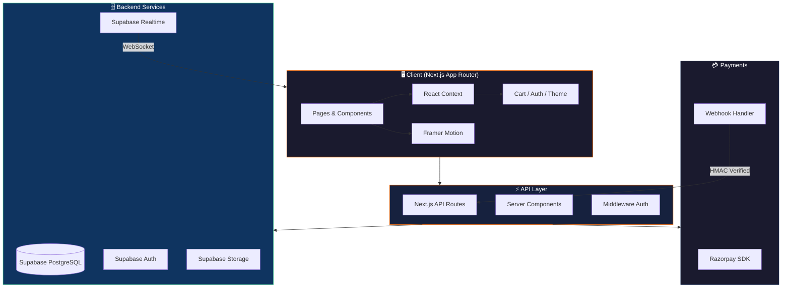

<div align="center">


<br />

# 🍽️ Foodie — Premium Food Delivery Platform

### _Discover. Order. Devour._

[](https://foodie-ecommerce.vercel.app)
[](https://nextjs.org/)
[](https://www.typescriptlang.org/)
[](https://supabase.com/)
[](https://tailwindcss.com/)
[](LICENSE)

<br />

**A full-stack, production-ready food delivery e-commerce platform** built with cutting-edge technologies.  
Featuring real-time order tracking, AI-powered recommendations, a community recipe hub, and a powerful admin dashboard.

<br />

[🌐 Live Demo](https://foodie-ecommerce.vercel.app) · [🐛 Report Bug](https://github.com/chaitanyaverma-blockchain/Project--Foodie/issues) · [💡 Request Feature](https://github.com/chaitanyaverma-blockchain/Project--Foodie/issues)

</div>

---

<br />

## ⚡ Quick Highlights

<table>
<tr>
<td width="50%">

### 🎨 Stunning Storefront
- Hero carousel with staggered animations
- Flying food-to-cart spring animations
- Dark/Light mode with smooth transitions
- Fully responsive mobile-first design

</td>
<td width="50%">

### 🛡️ Powerful Admin Panel
- Revenue & analytics dashboards with Recharts
- Full CRUD menu management
- Live order pipeline with real-time updates
- Coupon & discount management

</td>
</tr>
<tr>
<td width="50%">

### 🍳 Community Hub
- Share & discover community recipes
- "Cook It" & "Order It" interactions
- Recipe rating & engagement system
- Image uploads via Supabase Storage

</td>
<td width="50%">

### 🔐 Enterprise-Grade Security
- Supabase Auth with Row Level Security
- HMAC-SHA256 verified Razorpay webhooks
- Service role key isolation
- Protected admin routes

</td>
</tr>
</table>

<br />

---

<br />

## ✨ Feature Showcase

<details>
<summary><strong>🏠 Homepage & Navigation</strong></summary>

<br />

- 🎠 **Hero Carousel** — Auto-rotating slides with word-by-word staggered text animation
- 🔍 **Predictive Search** — Real-time search with debounced API calls and instant results
- 🏷️ **Category Scroll** — Horizontal scrollable category picker synced with URL filters
- 🎟️ **Promo Banners** — Dynamic countdown timer promotional banners from active coupons
- ❤️ **Your Favourites** — Personalized section showing user's favourite items
- 🔥 **Today's Deals** — Auto-curated items with active sale prices
- 🏆 **Best Sellers** — Ranked by order count with animated badges
- 👨‍🍳 **Chef's Special** — High-rated items with premium presentation
- 🤖 **AI Recommendations** — Smart suggestions based on browsing history
- 💬 **Chat Support** — Floating chat widget for customer assistance
- ⬆️ **Back to Top** — Smooth scroll button with fade animation

</details>

<details>
<summary><strong>🍕 Menu & Ordering</strong></summary>

<br />

- 🍕 **Dynamic Menu** — URL-synced filters for veg/non-veg, price range, cuisine, rating
- 🛒 **Flying Cart Animation** — Spring-physics food-to-cart animation
- 🎨 **Food Customization** — Variant selection, add-ons, and special instructions
- 💳 **Multi-Step Checkout** — Address → Payment → Confirmation with Razorpay
- 📦 **Real-Time Tracking** — Live order status via Supabase Realtime subscriptions
- 🧾 **Order History** — Complete order timeline with status tracking
- 🎟️ **Coupon System** — Apply discount codes with real-time validation

</details>

<details>
<summary><strong>👨‍💼 Admin Dashboard</strong></summary>

<br />

- 📊 **Analytics** — Revenue charts, order trends, and customer insights with Recharts
- 🍔 **Menu Management** — Full CRUD with drag-and-drop image upload to Supabase Storage
- 📋 **Order Pipeline** — Kanban-style real-time order management
- 🏷️ **Coupon Manager** — Create, edit, and deactivate promotional coupons
- 🚗 **Fleet Management** — Delivery fleet monitoring
- 🏪 **Restaurant Management** — Multi-restaurant support
- 👥 **User Management** — Role-based access control

</details>

<details>
<summary><strong>🍳 Community Features</strong></summary>

<br />

- 📝 **Recipe Sharing** — Submit recipes with images, ingredients, and instructions
- 🍳 **Cook It** — Step-by-step cooking mode with timer
- 🛒 **Order It** — One-click ordering of recipe ingredients
- ⭐ **Rating System** — Rate and review community recipes
- 📸 **Image Upload** — Drag-and-drop image support via Supabase Storage

</details>

<br />

---

<br />

## 🏗️ Tech Stack

<div align="center">

| Layer | Technology | Purpose |
|:---:|:---:|:---:|
| **Framework** |  | App Router, ISR, API Routes |
| **Language** |  | Type-safe development |
| **Styling** |  | Utility-first styling |
| **Animations** |  | Spring-physics animations |
| **Database** |  | PostgreSQL + Realtime |
| **Auth** |  | Email/Password + RLS |
| **Storage** |  | Image hosting & CDN |
| **Payments** |  | Payment processing |
| **Charts** |  | Analytics dashboards |
| **UI** |  | Accessible primitives |
| **State** |  | Global state management |
| **Deployment** |  | Edge deployment |

</div>

<br />

---

<br />

## 🗺️ Architecture



<br />

---

<br />

## 📁 Project Structure

```
foodie-ecommerce/
│
├── 📂 app/                          # Next.js App Router
│   ├── 📄 page.tsx                  # Homepage (ISR, 60s revalidation)
│   ├── 📂 about/                    # About page
│   ├── 📂 admin/                    # 🔐 Admin dashboard
│   │   ├── 📄 page.tsx              # Admin overview
│   │   ├── 📂 analytics/            # Revenue & order charts
│   │   ├── 📂 coupons/              # Coupon management
│   │   ├── 📂 fleet/                # Delivery fleet
│   │   ├── 📂 menu/                 # Food item CRUD
│   │   ├── 📂 orders/               # Order pipeline
│   │   ├── 📂 recipes/              # Recipe management
│   │   ├── 📂 restaurants/          # Restaurant management
│   │   └── 📂 users/                # User management
│   ├── 📂 api/                      # API routes
│   │   ├── 📂 admin/food-items/     # Admin food CRUD API
│   │   ├── 📂 orders/               # Order create & verify
│   │   ├── 📂 razorpay/             # Razorpay webhook handler
│   │   ├── 📂 recipes/              # Recipe submission API
│   │   └── 📂 setup-db/             # Database setup
│   ├── 📂 auth/                     # Auth pages (login, signup, callback)
│   ├── 📂 checkout/                 # Multi-step checkout
│   ├── 📂 community/               # 🍳 Community recipe hub
│   ├── 📂 favorites/               # User favorites
│   ├── 📂 menu/                     # Menu listing & filters
│   ├── 📂 orders/                   # Order history & tracking
│   └── 📂 profile/                  # User profile
│
├── 📂 components/                   # React components
│   ├── 📂 admin/                    # Admin-specific components
│   ├── 📂 checkout/                 # Checkout flow components
│   ├── 📂 community/               # Recipe cards, modals
│   ├── 📂 home/                     # Homepage sections
│   ├── 📂 layout/                   # Header, Footer, CartDrawer
│   ├── 📂 menu/                     # Menu grid, filters
│   ├── 📂 profile/                  # Profile components
│   ├── 📂 providers/               # Context providers
│   └── 📂 ui/                      # Reusable UI primitives
│
├── 📂 context/                      # React Contexts
│   ├── 📄 CartContext.tsx           # Cart state & operations
│   ├── 📄 AuthContext.tsx           # Auth state & guards
│   ├── 📄 ThemeContext.tsx          # Dark/Light mode
│   └── 📄 FoodDrawerContext.tsx     # Food detail drawer
│
├── 📂 lib/                          # Utilities & clients
│   └── 📂 supabase/                # Server & client Supabase instances
│
├── 📂 types/                        # TypeScript type definitions
├── 📂 supabase/                     # Database migrations
│   └── 📂 migrations/              # SQL migration files
│
└── 📂 docs/                         # Documentation assets
    └── 🖼️ banner.jpg               # README banner image
```

<br />

---

<br />

## 🚀 Getting Started

### Prerequisites

- **Node.js** 18+ — [Download](https://nodejs.org/)
- **npm** or **yarn**
- **Supabase** account — [Sign up](https://supabase.com)
- **Razorpay** account _(optional, for payments)_ — [Sign up](https://razorpay.com)

### 1️⃣ Clone the Repository

```bash
git clone https://github.com/chaitanyaverma-blockchain/Project--Foodie.git
cd Project--Foodie
```

### 2️⃣ Install Dependencies

```bash
npm install
```

### 3️⃣ Set Up Supabase

1. Create a new project at [supabase.com](https://supabase.com)
2. Navigate to **SQL Editor** and run the migration files from `supabase/migrations/`
3. Copy your credentials from **Settings → API**

### 4️⃣ Configure Environment

Create a `.env.local` file in the root directory:

```env
# 🗄️ Supabase
NEXT_PUBLIC_SUPABASE_URL=https://your-project.supabase.co
NEXT_PUBLIC_SUPABASE_ANON_KEY=your-anon-key
SUPABASE_SERVICE_ROLE_KEY=your-service-role-key

# 💳 Razorpay
NEXT_PUBLIC_RAZORPAY_KEY_ID=your-razorpay-key-id
RAZORPAY_KEY_ID=your-razorpay-key-id
RAZORPAY_KEY_SECRET=your-razorpay-secret
RAZORPAY_WEBHOOK_SECRET=your-webhook-secret

# 🌐 App
NEXT_PUBLIC_APP_URL=http://localhost:3000
```

### 5️⃣ Run the Development Server

```bash
npm run dev
```

Open [http://localhost:3000](http://localhost:3000) and enjoy! 🎉

<br />

---

<br />

## 👨‍💼 Admin Access

After signing up, promote yourself to admin via the **Supabase SQL Editor**:

```sql
UPDATE profiles SET role = 'admin' WHERE email = 'your@email.com';
```

Then navigate to `/admin` to access the full admin dashboard.

<br />

---

<br />

## 🌐 Deployment

### Deploy to Vercel (Recommended)

```bash
npm install -g vercel
vercel login
vercel deploy --prod
```

> **Important:** Add all environment variables in your [Vercel project settings](https://vercel.com/docs/environment-variables) before deploying.

### Razorpay Webhook Setup

Configure webhooks in your [Razorpay Dashboard](https://dashboard.razorpay.com/):

| Setting | Value |
|---|---|
| **URL** | `https://your-domain.vercel.app/api/razorpay/webhook` |
| **Events** | `payment.captured`, `payment.failed`, `refund.created` |
| **Secret** | Your `RAZORPAY_WEBHOOK_SECRET` |

<br />

---

<br />

## 🤝 Contributing

Contributions are what make the open-source community amazing! Any contributions you make are **greatly appreciated**.

1. **Fork** the repository
2. **Create** your feature branch (`git checkout -b feature/amazing-feature`)
3. **Commit** your changes (`git commit -m 'Add amazing feature'`)
4. **Push** to the branch (`git push origin feature/amazing-feature`)
5. **Open** a Pull Request

<br />

---

<br />

## 📄 License

Distributed under the **MIT License**. See [`LICENSE`](LICENSE) for more information.

<br />

---

<br />

<div align="center">

### ⭐ Star this repo if you found it useful!

<br />

Made with ❤️ and lots of 🍕

<br />

[](https://github.com/chaitanyaverma-blockchain)

</div>
